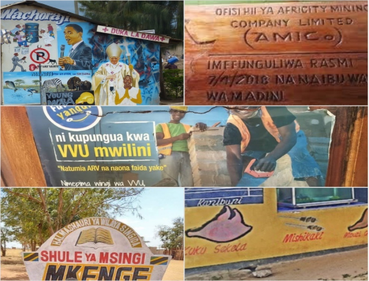

# Swahili-STR-Dataset

Accepted by ICDAR 2024
The link of our paper: 
Researchers and developers can download the dataset, including the full images, cropped word images, and annotations, from our official repository.
The download links are as follows:
Baidu Netdisk Link：https://pan.baidu.com/s/1rdEF18XgBWsjCHUKRTTNkA  Extraction code：fadi
Google drive: https://drive.google.com/file/d/1E-5onOU_d-dRLbUTwpyzefj8t4g9G8Jj/view?usp=drive_link
Swahili Language Scene Text Detection and Recognition Dataset.
Researchers and developers can access and download the dataset, which includes full images, cropped word images, and annotations, from our official repository. The download link is:
链接：https://pan.baidu.com/s/1rdEF18XgBWsjCHUKRTTNkA 
提取码：fadi 
